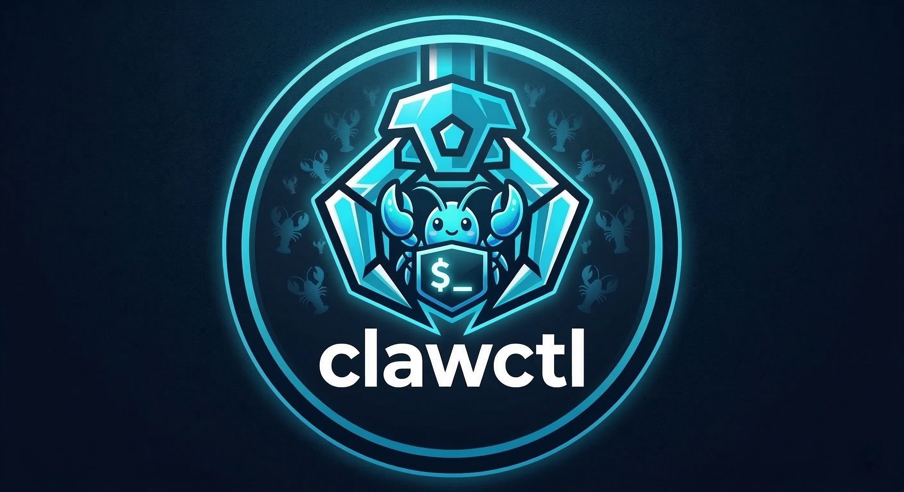

<p align="center">
  
</p>

<h1 align="center">clawctl</h1>

<p align="center">
  <strong>Full-lifecycle management for OpenClaw instances on macOS.</strong><br>
  <em>One command to create, provision, and manage isolated VMs — no SSH required.</em>
</p>

---

Run OpenClaw in an isolated VM without ever SSHing in to set things up.
clawctl handles the full lifecycle — creating a Lima VM, provisioning it with
everything OpenClaw needs, running onboarding, and managing instances
afterwards. Your project directory on the host is the source of truth: config
and persistent data live there, editable and backed up by git.

## Quickstart

```bash
# Interactive wizard
clawctl create

# Headless (config-file-driven, no prompts)
clawctl create --config config.json
```

The wizard walks you through configuration and creates everything automatically.
For CI/CD or scripted setups, use [headless mode](docs/headless-mode.md) with
a JSON config file.

## Prerequisites

- **macOS** on **Apple Silicon** (M1/M2/M3/M4)
- **Homebrew** installed ([brew.sh](https://brew.sh))
- **Bun** installed (`brew install oven-sh/bun/bun`)

Lima is installed automatically by the CLI if not already present.

## What happens

The wizard checks your prerequisites, prompts for VM settings (name, CPUs,
memory, disk, project directory), then creates an Ubuntu 24.04 arm64 VM using
Lima with the vz backend and virtiofs mounts. It provisions the VM with
Node.js 22, Tailscale, Homebrew, and the 1Password CLI — then optionally
configures credentials and runs OpenClaw's onboarding wizard inside the VM.

When it's done, your dashboard is live at `http://localhost:18789`.

The project directory on your Mac contains `clawctl.json` (the instance
recipe, safe to commit) and a `data/` folder that's mounted as writable
storage inside the VM. Data there survives VM deletion and recreation.

## Commands

| Command                                    | Description                                   |
| ------------------------------------------ | --------------------------------------------- |
| `clawctl create`                           | Interactive wizard                            |
| `clawctl create --config <path>`           | Headless mode (config-file-driven)            |
| `clawctl list`                             | List all instances with live status           |
| `clawctl status <name>`                    | Detailed info for one instance                |
| `clawctl start <name>`                     | Start a stopped instance                      |
| `clawctl stop <name>`                      | Stop a running instance                       |
| `clawctl restart <name>`                   | Stop + start + health checks                  |
| `clawctl delete <name> [--purge]`          | Delete VM; `--purge` also removes project dir |
| `clawctl shell <name>`                     | Shell into the VM                             |
| `clawctl register <name> --project <path>` | Register an existing (pre-registry) instance  |

Running bare `clawctl` or `clawctl --help` shows help.

## After setup

```bash
# List your instances
clawctl list

# Access the dashboard
open http://localhost:18789

# Enter the VM
clawctl shell my-agent

# Stop / start / restart
clawctl stop my-agent
clawctl start my-agent
clawctl restart my-agent

# Delete (keeps project dir by default)
clawctl delete my-agent

# Delete everything
clawctl delete my-agent --purge
```

Instances are tracked in `~/.config/clawctl/instances.json` — this powers
`clawctl list`, `clawctl status`, and the other management commands. Instances
are registered automatically on create, or manually via `clawctl register`.

For automated or CI/CD setups, see [Headless Mode](docs/headless-mode.md).

## Documentation

### Getting started

- [Getting Started](docs/getting-started.md) — guided walkthrough for first-time users

### Guides

- [Headless Mode](docs/headless-mode.md) — config-file-driven provisioning for CI and scripted setups
- [Config Reference](docs/config-reference.md) — full schema for headless config files
- [1Password Setup](docs/1password-setup.md) — service accounts and `op://` secret references
- [Tailscale Setup](docs/tailscale-setup.md) — auth keys, ACLs, remote dashboard access
- [Snapshots and Rebuilds](docs/snapshots-and-rebuilds.md) — cloning VMs, data persistence, full rebuilds
- [Project Directory](docs/project-directory.md) — what the CLI creates and how to customize it
- [Troubleshooting](docs/troubleshooting.md) — common issues and fixes

### Internals

- [Architecture](docs/architecture.md) — system design, tech stack, component relationships
- [CLI Wizard Flow](docs/cli-wizard-flow.md) — each wizard step in detail
- [VM Provisioning](docs/vm-provisioning.md) — what gets installed and how
- [Testing](docs/testing.md) — test strategy, running tests, adding new tests

## Development

```bash
bun bin/cli.tsx create                                     # run the wizard
bun bin/cli.tsx create --config example-config.json        # headless mode
bun build ./bin/cli.tsx --compile --outfile dist/clawctl   # build binary
bun test                                                   # unit tests
bun run lint                                               # ESLint
bun run format:check                                       # Prettier check
```

See [Testing](docs/testing.md) for the full test strategy.
